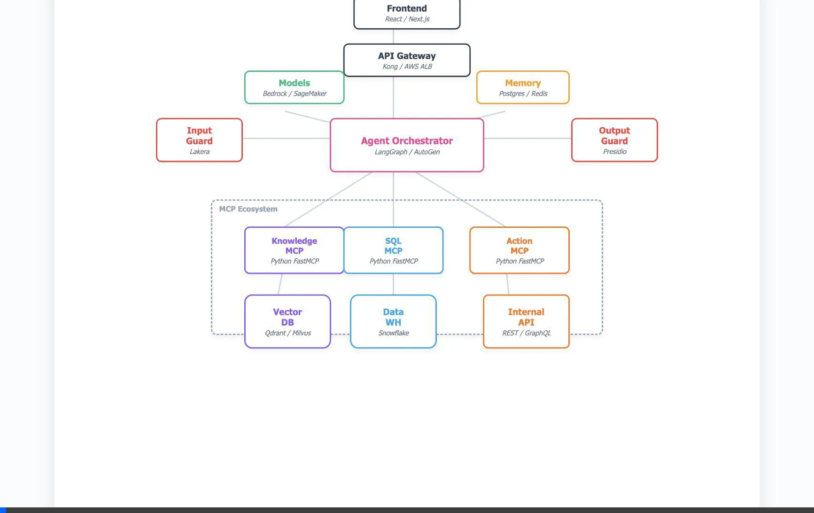
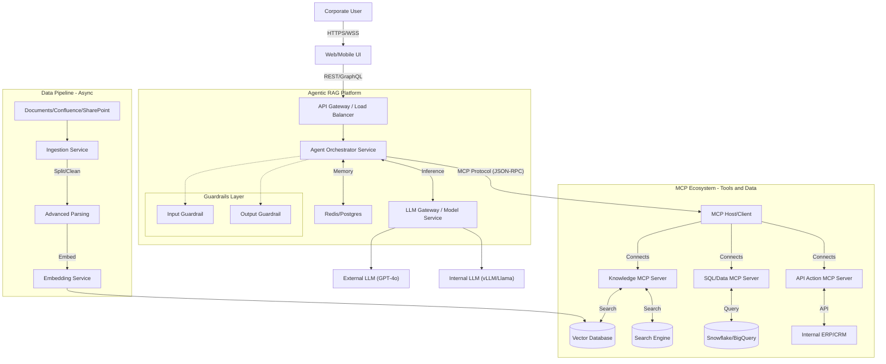

# High-Level Design (HLD): Enterprise Agentic RAG with MCP

> **Status**: DRAFT
> **Version**: 1.0
> **Date**: 2026-01-19

## 1. Executive Summary
This document outlines the High-Level Design for a production-grade **Agentic Retrieval-Augmented Generation (RAG)** system suitable for enterprise environments. The architecture moves beyond simple "Chain" based RAG to an **Agentic** approach, utilizing the **Model Context Protocol (MCP)** to standardize connections between the AI Reasoning Engine (The Agent) and enterprise data/tools.

Key differentiating features:
- **Agentic Core**: Dynamic planning and tool use instead of static pipelines.
- **MCP Integration**: Standardized protocol for connecting to internal Data & API silos.
- **Hybrid Search**: Semantic (Vector) + Keyword (BM25) + Re-ranking.
- **Enterprise Guardrails**: PII redaction, topic adherence, and hallucination detection.

> **Note**: For a detailed comparison between this Agentic approach and standard Pipeline RAG, please see the [Architecture Comparison Document](./ARCHITECTURE_COMPARISON.md).

## 2. System Context Diagram
The system sits between Corporate Users and the Enterprise Data Ecosystem.

## 3. Core Component Architecture

### 3.1. Frontend & Gateway Layer
- **UI**: Supports streaming responses, citation rendering, and "thought process" visibility (optional).
- **Gateway**: Handles AuthN (SSO/SAML), Rate Limiting, and Request Validation.

### 3.2. Agent Orchestrator (The "Brain")
- **Role**: Replaces the static RAG chain. It receives the user query, maintains conversation history, and decides *which* tools to call.
- **Framework**: LangGraph / AutoGen / Custom State Machine.
- **Logic**:
    1.  **Plan**: Deconstruct query (e.g., "Compare sales Q1 vs Q2").
    2.  **Tool Selection**: Decide to call `Knowledge_MCP` (for policy) or `SQL_MCP` (for sales data).
    3.  **Synthesize**: Combine results into a cohesive answer.

### 3.3. Model Context Protocol (MCP) Layer
Standardizes how the Agent accesses data. Instead of hardcoding SDKs for every DB, we use MCP Servers.
- **MCP Host**: The runtime within the Agent Platform that manages connections to MCP Servers.
- **MCP Servers**: Lightweight sidecars or services that expose specific resources (Prompts, Resources, Tools).
    - *Example*: A Salesforce MCP Server exposes `get_customer(id)` as a tool.

### 3.4. Retrieval & Knowledge Base (The "Library")
- **Hybrid Search**: Combines Dense Vector Search (KNN) for semantic meaning and Sparse Keywood Search (BM25) for exact matches (product codes, names).
- **Re-ranking**: A Cross-Encoder model (e.g., Cohere Rerank, BGE-Reranker) rescores the top-N results to improve precision before sending to the LLM.

### 3.5. Data Ingestion Pipeline (The "Knowledge Factory")
- **Process**:
    - **Source Connectors**: Periodic sync from Confluence, SharePoint, Jira, Google Drive.
    - **Extraction (Unstructured ETL)**:
        - *PDF/Images*: OCR using Tesseract or proprietary models (Adobe/AWS Textract) to extract text + layout.
        - *Tables*: Flattening tables into Markdown or JSON representations to preserve semantic structure.
    - **Transformation**:
        - *Cleaning*: Remove headers, footers, legal disclaimers.
        - *Metadata Extraction*: Use LLM to extract "Relevant Products", "Department", "Date" for pre-filtering.
    - **Chunking Strategy**:
        - *Parent-Child Indexing*: Split docs into huge "Parent" chunks (e.g., 2000 tokens) for context, but index small "Child" chunks (512 tokens) for search. Return the Parent to the LLM.
        - *Semantic Chunking*: Break on topic shifts rather than fixed character counts.
    - **Embedding**: Batch processing via GPU instances. Pushing vectors to Qdrant/Weaviate.

### 3.6. Advanced Retrieval & Ranking Module
- **Stage 1: Multi-Index Retrieval**:
    - Query moves to 3 separate indices: `Keywords` (BM25 for exact product codes), `Vectors` (Dense for concept search), `Hypothetical Questions` (mapping user query to potential FAQ-style questions).
- **Stage 2: Fusion**:
    - Reciprocal Rank Fusion (RRF) combines the lists.
- **Stage 3: Cohere Re-ranking**:
    - A Cross-Encoder model scores the top 50 pairs of (User Query, Document Chunk) for deep semantic relevance.
    - Filters out results with score < 0.7 (noise filtering).
- **Stage 4: Context Assembly**:
    - Top 5-10 chunks are assembled. Metadata is pre-pended (e.g., "Source: HR Policy 2024").

### 3.7. Safety & Governance (Guardrails)
- **Input Rails**: detailed prompt injection detection (e.g., Lakera, NeMo Guardrails).
- **Output Rails**: PII redaction (Microsoft Presidio) and Hallucination checks (Self-Check GPT or citation verification).

## 4. Key Workflows

### 4.1. "Smart" Retrieval Flow
1.  **User Query**: "What is the reimbursement policy for travel?"
2.  **Agent**: Analyzes query. Calls `mcp_knowledge_server.search(query="travel reimbursement policy", filters={type: "policy"})`.
3.  **MCP Server**: Executes Hybrid Search on VectorDB + Re-ranks results. Returns top 5 chunks.
4.  **Agent**: Reads chunks. Determines answer is sufficient.
5.  **Agent**: Generates response with citations.

### 4.2. Complex Multi-Step Flow
1.  **User Query**: "Summarize the ACME project status and email it to the PM."
2.  **Agent**: 
    - Step 1: Call `mcp_jira_server.get_tickets(project="ACME")`.
    - Step 2: Call `mcp_confluence_server.get_page(title="ACME Roadmap")`.
    - Step 3: Synthesize summary.
    - Step 4: Ask User for confirmation to send email? (Human-in-the-loop).
    - Step 5: Call `mcp_outlook_server.send_email(...)`.

## 5. Evaluation & Continuous Improvement
To ensure the system remains "Production-Ready," we implement rigorous evaluation:

### 5.1. Offline Evaluation (Pre-Deployment)
- **Frameworks**: Ragas (Retrieval Augmented Generation Assessment) or TruLens.
- **Metrics**:
    - *Context Recall*: Is the retrieved context actually relevant?
    - *Faithfulness*: Is the answer derived *only* from the context (no hallucination)?
    - *Answer Relevancy*: Does it answer the user's question?
- **Golden Dataset**: A curated set of 200+ QA pairs verified by domain experts (SMEs). New code/prompts must pass score thresholds (e.g., > 0.85).

### 5.2. Online Evaluation (Post-Deployment)
- **User Feedback**: Thumbs up/down on every response. "Down" triggers a bug report for review.
- **A/B Testing**: Serve distinct prompt versions to 50/50 traffic and measure "Copy/Paste rate" or "Thumbs Up rate."

## 6. Observability & Monitoring
We treat the Agent like a Microservice using "Standard + LLM" observability.

- **Distributed Tracing**: OpenTelemetry instrumentation on the Orchestrator, MCP Hosts, and VectorDB.
    - Tools: Jaeger, Honeycomb, or Arize Phoenix.
- **Metrics (Prometheus/Grafana)**:
    - *System*: P95/P99 Latency, Error Rate, RPS (Requests Per Second).
    - *LLM Specific*: Token usage (Input/Output), Cost per Query, Average "Reasoning Steps" count.
- **Logging**: Structured logs (JSON) sent to ELK (Elasticsearch/Logstash/Kibana) or Splunk.
    - *Audit Log*: Who asked what, when, and exactly which documents were cited (critical for Legal/Compliance).
- **Cost Governance**:
    - *Budgeting*: Hard usage limits and alerts per department/tenant.
    - *Granularity*: Track cost per request and cost per feature.

## 7. Infrastructure & Scalability
Reference architecture for High Availability (HA) and Scale.

### 7.1. Cloud Deployment (AWS Reference)
- **Compute**:
    - *Orchestrator/API*: EKS (Kubernetes) or ECS Fargate (Serverless Containers). Auto-scaling based on CPU/Memory/Queue Depth.
    - *LLM Ops*: SageMaker Endpoints or vLLM on EC2 `g5.xlarge` instances for self-hosted models. Use **Spot Instances** for stateless inference nodes where possible to reduce costs. Use **Quantized Models** (AWQ/GPTQ) to lower VRAM requirements.
- **Data Stores**:
    - *Vector DB*: Qdrant Managed Cloud or Self-hosted on EKS with SSD-backed nodes (NVMe). High replication factor (x3).
    - *State Store*: AWS RDS (Postgres) or ElastiCache (Redis) for Conversation History.

### 7.2. High Availability & Load Balancing
- **Load Balancer (ALB)**: Application Load Balancer distributes Websockets/HTTP traffic across availability zones (Multi-AZ).
- **Circuit Breakers**: If the primary LLM (e.g., GPT-4) times out or hits rate limits, automatically failover to a fallback model (e.g., Claude 3 Haiku or internal Llama 3) to prevent downtime.

### 7.3. Performance Targets
- **Throughput**: Support 500+ concurrent active chats.
- **Latency (SLOs)**:
    - *Time-to-First-Token (TTFT)*: < 800ms (Streaming).
    - *Total End-to-End Latency*: < 5s for Simple RAG, < 15s for Complex Agentic Plans.

## 8. Technology Stack Recommendations
- **LLM**: GPT-4o / Claude 3.5 Sonnet (Capabilities), Llama 3 70B (Private).
- **Orchestration**: LangGraph (Python) or customized LangChain.
- **Vector DB**: Qdrant / Weaviate / Milvus (Production scale).
- **Ingestion**: Unstructured.io / LlamaParse.
- **Evaluation**: Ragas / TruLens (for offline eval).
- **Observability**: OpenTelemetry + Jaeger (Tracing), Prometheus (Metrics), ELK (Logs), Arize Phoenix (LLM Tracing).
- **Infrastructure**: Kubernetes (EKS/GKE), AWS SageMaker / Bedrock.

## 9. Cost Optimization Strategy
To ensure the solution remains economically viable at enterprise scale, we adopt the following optimization playbook:

### 9.1. Model Strategy Optimization
- **Dynamic Model Routing**:
    - Use a "Router" component to classify queries by complexity.
    - *Simple Tasks* (e.g., Greetings, Fact Retrieval): Route to smaller, cheaper models (e.g., GPT-3.5, Claude 3 Haiku, or Llama 3 8B).
    - *Complex Tasks* (e.g., Reasoning, Plan generation): Route to SOTA models (e.g., GPT-4o, Claude 3.5 Sonnet).
- **Task-Based Selection**: Avoid "one size fits all". Use specialized small models for specific narrow tasks (e.g., PII detection, topic classification).

### 9.2. Inference & Runtime Efficiency
- **Response Caching (Semantic Cache)**:
    - Implement a Semantic Cache (e.g., GPTCache, Redis Semantic Cache) to store `(Query Vector, Response)` pairs.
    - High similarity hits (>0.95) return cached responses instantly, bypassing the LLM entirely (0 cost).
- **Batch Inference**:
    - For background jobs (e.g., nightly report generation), use batch APIs (50% discount) rather than real-time synchronous APIs.

### 9.3. Prompt & Context Control
- **Prompt Compression**:
    - Use techniques like `LLMLingua` to compress the prompt context, removing redundant tokens while preserving information.
- **Context Window Pruning**:
    - Strict `top_k` limits on retrieval. Don't stuff 20 documents if 3 will do. Use Re-ranking to ensure the top 3 are high quality.
- **Structured Outputs**:
    - Use JSON mode to reduce "chatty" conversational filler in API responses, saving output tokens.
