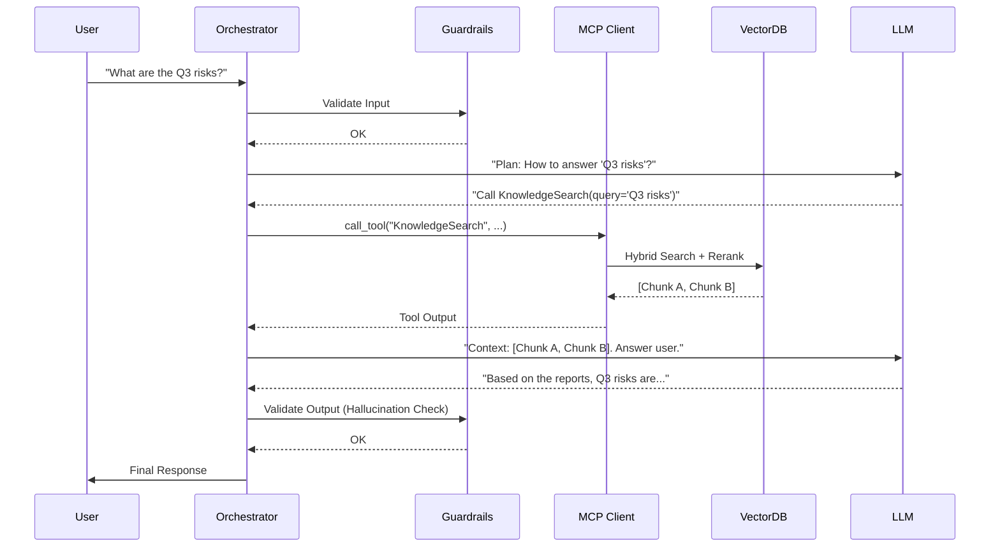

# Low-Level Design (LLD): Enterprise Agentic RAG with MCP

> **Status**: DRAFT
> **Version**: 1.0
> **Date**: 2026-01-19

## 1. Introduction
This Low-Level Design (LLD) document details the implementation specifics for the Agentic RAG system defined in the HLD. It covers API specifications, data schemas, component class designs, and configuration parameters required for development.

## 2. API Specifications

### 2.1. Agent Interaction API
The primary entry point for the frontend or external systems. Recommended to follow OpenAI-compatible limits for easier integration.

**Endpoint**: `POST /v1/agent/chat`

**Request Body**:
```json
{
  "session_id": "uuid-v4",
  "user_id": "corp-user-123",
  "messages": [
    { "role": "user", "content": "Fetch the Q3 sales report for EMEA." }
  ],
  "config": {
    "temperature": 0.1,
    "model": "gpt-4o"
  }
}
```

**Response Stream (Server-Sent Events)**:
- `event: tool_start` -> Payload: `{ tool: "mcp_sales_db", input: "..." }`
- `event: tool_end` -> Payload: `{ output: "..." }`
- `event: thought` -> Payload: `{ content: "Found data, now summarizing." }`
- `event: token` -> Payload: `{ text: "The" }` ...
- `event: complete` -> Payload: `{ citation_ids: ["doc-123"] }`

### 2.2. MCP Server Interface (JSON-RPC 2.0)
Each MCP Server (Knowledge, SQL, etc.) must implement the Model Context Protocol.

**Method**: `tools/list`
**Response**:
```json
{
  "tools": [
    {
      "name": "search_knowledge_base",
      "description": "Semantic search over corporate documents",
      "inputSchema": {
        "type": "object",
        "properties": {
          "query": { "type": "string" },
          "filters": { "type": "object" }
        }
      }
    }
  ]
}
```

**Method**: `tools/call`
**Params**: `{ "name": "search_knowledge_base", "arguments": { "query": "travel policy" } }`

## 3. Data Schema Design

### 3.1. Vector Database Schema (Qdrant/Milvus)
**Collection**: `corporate_knowledge`

| Field Name | Type | Description |
| :--- | :--- | :--- |
| `id` | UUID | Unique Chunk ID |
| `vector` | Float32 Array | 1536-dim Embedding (e.g., OpenAI small) |
| `payload.content` | Text | The actual chunk text |
| `payload.source_url` | String | Link to original document (SharePoint/Web) |
| `payload.metadata` | JSON | `{ "author": "HR", "date": "2025-01-01", "dept": "Legal" }` |
| `payload.doc_id` | UUID | Parent Document ID |

### 3.2. Relational Database (PostgreSQL)
Used for conversation history (Memory) and User Feedback.

**Table: `sessions`**
- `session_id` (PK, UUID)
- `user_id` (Index)
- `created_at` (Timestamp)
- `metadata` (JSONB) - store user preferences or context

**Table: `messages`**
- `id` (PK)
- `session_id` (FK)
- `role` (enum: user, assistant, system, function)
- `content` (Text)
- `token_count` (Int)

**Table: `feedback`**
- `id` (PK)
- `message_id` (FK) - The AI response being rated
- `score` (Int) - +1 or -1
- `comment` (Text)

## 4. Component Design & Logic

### 4.1. Ingestion Worker (Python / Celery)
**Modules**:
1.  **`DocumentLoader`**: Factory pattern to load `PdfLoader`, `HtmlLoader`.
2.  **`TextSplitter`**:
    - *Logic*: RecursiveCharacterTextSplitter with `chunk_size=512`, `chunk_overlap=50`.
    - *Semantic Extension*: If header is detected, force new chunk.
3.  **`MetadataExtractor`**: Extract Title, Date using Regex or LLM (expensive but accurate).
4.  **`EmbeddingClient`**: Automatic retry with exponential backoff for API rate limits.

### 4.2. Retrieval Engine (The "RAG" Core)
**Class**: `HybridRetriever`
- **Method `retrieve(query, top_k=20)`**:
    - Parallel execution:
        - `self.vector_db.search(query_vector)`
        - `self.keyword_db.search(query_text)` (Elasticsearch/BM25)
    - **Fusion**: Reciprocal Rank Fusion (RRF) to combine lists.
- **Method `rerank(results, top_k=5)`**:
    - Input: 20 fused results.
    - Action: Call Cross-Encoder (Cohere/BGE).
    - Output: Top 5 most relevant chunks.

### 4.3. Agent Orchestrator (LangGraph)
**Graph Nodes**:
- **`__start__`**: Analyze input.
- **`router`**: Logic: `if query needs_data -> goto tools; else -> goto direct_response`.
- **`tools_execution`**: Iterate tool calls and execute MCP clients.
- **`reflect`** (Optional): Criticize own output (for complex tasks).
- **`generate`**: Final LLM synthesis with citations.

## 5. Sequence Diagram: Query Execution



## 6. Configuration & Environment Variables

| Variable | Default | Description |
| :--- | :--- | :--- |
| `OPENAI_API_KEY` | - | Core LLM Key |
| `VECTOR_DB_URL` | `localhost:6333` | Qdrant/Milvus Endpoint |
| `MCP_KNOWLEDGE_URL` | `http://mcp-knowledge:8080` | Internal MCP Server |
| `CHUNK_SIZE` | `512` | Token count per chunk |
| `RERANK_ENABLED` | `true` | Enable cross-encoder reranking |
| `LOG_LEVEL` | `INFO` | Application logging level |
