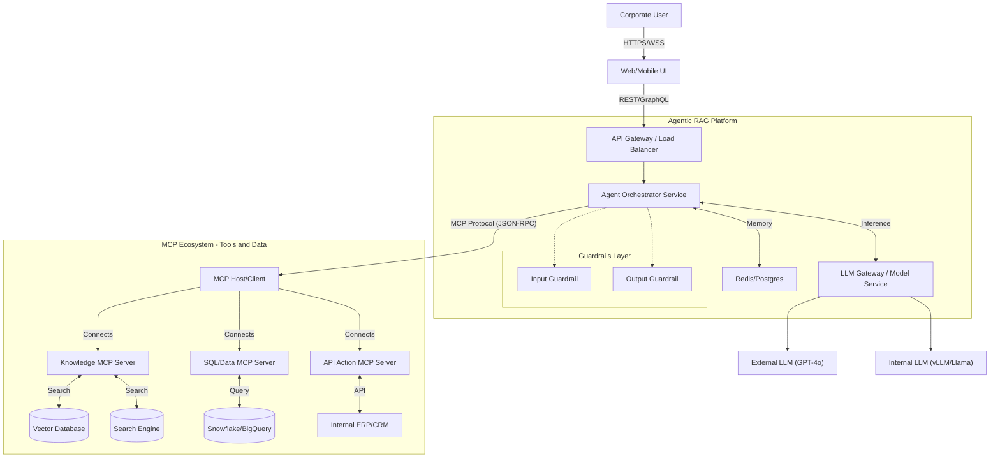

# Enterprise Agentic RAG with MCP

> **A production-grade Agentic Retrieval-Augmented Generation system using the Model Context Protocol (MCP).**

## 🚀 Overview
This project implements a next-generation **Agentic RAG** architecture designed for enterprise scale. Unlike traditional linear RAG chains, this system uses an **Agent Orchestrator** ("The Brain") to dynamically plan, select tools, and synthesize answers from disparate corporate data sources (SharePoint, Databases, APIs) via the **Model Context Protocol (MCP)**.

## 📚 Documentation
The engineering and design documentation is split into the following detailed guides:

| Document | Description |
| :--- | :--- |
| 📘 **[High-Level Design (HLD)](./HLD.md)** | Strategic architecture, component breakdown, cost optimization strategies, and system context. |
| ⚙️ **[Low-Level Design (LLD)](./LLD.md)** | Implementation details, API specifications, database schemas, and configuration. |
| ⚖️ **[Architecture Comparison](./ARCHITECTURE_COMPARISON.md)** | A deep dive into why we chose an *Agentic* approach over standard *Pipeline* RAG. |

## ✨ Key Features
*   **Agentic Core**: Dynamic planning and reasoning loop (Loop-based).
*   **MCP Ecosystem**: Standardized connectivity to internal data silos.
*   **Hybrid Search**: Dense Vector + Sparse Keyword (BM25) + Cohere Re-ranking.
*   **Cost Optimized**: Smart routing between Small/Large models and semantic caching.
*   **Enterprise Guardrails**: PII redaction and Hallucination checks.

## 🏗️ Architecture

